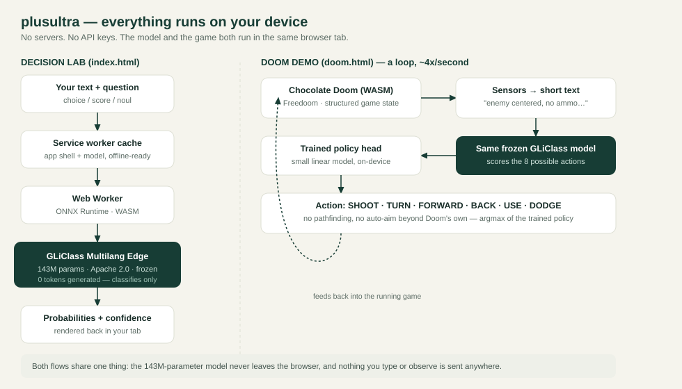

<div align="center">

# plusultra

**A text-decision engine and a Doom-playing agent that both run entirely inside your browser tab.**

No servers. No API keys. No accounts. Nothing you type is ever sent anywhere.

[](https://github.com/Sebx/plusultra)
[](https://github.com/Sebx/plusultra/actions/workflows/ci.yml)
[](LICENSE)
[](licenses/model-Apache-2.0.txt)
[](BENCHMARKS.md)
[](#how-it-works)
[](#how-it-works)
[](CONTRIBUTING.md)

[Quickstart](#quickstart) · [How it works](#how-it-works) · [Doom demo](#doom-demo) · [Limitations](#limitations-read-this) · [License](#license--credits)

</div>

---

plusultra loads a 143M-parameter classification model ([GLiClass Multilang Edge](https://huggingface.co/knowledgator/gliclass-multilang-edge), Apache 2.0) straight into your browser with ONNX Runtime, and uses it to classify, score, or evaluate any text you give it — no cloud call, no signup, no tracking. Once cached it keeps working offline as an installable PWA.

As a second, more visual proof that the same frozen model can reason locally, plusultra also ships a live demo where that model plays classic **Doom**: it reads structured game sensors (not pixels), a small trained policy head turns its scores into an action, and the whole loop — engine, model, and policy — runs on your GPU or CPU, again with nothing leaving the tab.

<p align="center"></p>

## Why plusultra?

✅ **Zero cloud APIs** — Run locally, nothing leaves your machine  
✅ **Three runtimes** — Browser (WASM), Python, or Rust — pick what fits  
✅ **Fast** — 140–180 ms latency (p50) from text to decision  
✅ **Privacy-first** — No servers, no accounts, no tracking  
✅ **Proof it works** — Doom-playing AI that reads game sensors in real-time  
✅ **Offline ready** — Works completely offline after first load  
✅ **Open source** — MIT licensed, all dependencies pinned  

Compare to cloud APIs like AWS Comprehend or Hugging Face Inference:

| Feature | Cloud API | plusultra |
|---------|-----------|-----------|
| Latency | 500ms–5s | 140–180ms |
| Cost / 1M queries | $1,200 | $0 |
| Privacy | ⚠️ Sent to cloud | ✓ Local only |
| Offline | ❌ No | ✅ Yes |
| Setup | API keys + billing | Open URL or `pip install` |

## Why this exists

Most "AI-powered" tools quietly assume a server. plusultra is a demonstration that a useful, modern classification model can run entirely client-side — in a form small enough to cache, fast enough to feel interactive, and honest enough to tell you exactly where it's uncalibrated. The Doom demo pushes that same idea further: if a browser can run a real 90s game engine *and* a real neural network *and* keep both in sync 4 times a second, "needs a backend" is often a choice, not a requirement.

## Quickstart

### 🌐 Browser (Easiest — Zero Setup)

```bash
git clone https://github.com/Sebx/plusultra.git
cd plusultra
bash start-mac.sh              # macOS
# OR
start-windows.cmd             # Windows
# OR  
python3 -m http.server 8787   # Linux
```

Then open **`http://localhost:8787`** → click **Load local engine** → works offline.

### 🐍 Python (Integration)

```bash
pip install onnxruntime transformers
cd python/
python examples/basic_classification.py
```

### 🦀 Rust (Production)

```bash
cd rust/
cargo build --release
./target/release/plusultra classify "Your text" --criteria "option1,option2"
```

See [NATIVE_RUNTIMES.md](NATIVE_RUNTIMES.md) for full guides.

> **Don't** open `index.html` via `file://` — the app needs to be served (even just locally) for the service worker, module scripts, and model fetches to work.

Requirements: a modern browser with WebAssembly SIMD, Web Workers, and BigInt support (any current Chrome, Edge, or Firefox). The model + tokenizer need about 312 MB of storage, split into SHA-256-verified chunks so the browser cache can hold them.

## How it works

1. **You** type text plus a question (`choice`, `score`, or `noul` — a yes/no-with-nuance type), or pick a preset.
2. A **service worker** serves the app shell from cache after the first load, so the whole thing works offline.
3. A **Web Worker** runs [ONNX Runtime](https://github.com/microsoft/onnxruntime) (WASM, or WebGPU in the Doom demo) and loads the frozen GLiClass weights.
4. The model returns a probability distribution over your options; the UI renders it with a confidence measure that is explicitly labeled as **concentration, not correctness**.

Nothing here calls out to the network after the first load. `model/manifest.json` records the exact SHA-256 of every weight file, and the tokenizer, ONNX Runtime, and packaging tooling are all pinned, open-source dependencies (see [Licenses & credits](#license--credits)).

## Doom demo

Open `/doom.html` → **Prepare Doom + AI** → **Let the AI play**. [Chocolate Doom](https://github.com/chocolate-doom/chocolate-doom) and [Freedoom](https://github.com/freedoom/freedoom) run compiled to WebAssembly; the same GLiClass model scores 8 possible actions from a short text description of what's on screen (never pixels), and a small trained linear policy head combines those scores with a few engineered signals — nearby walls, recent damage, whether a door was just used, whether you're out of ammo — to pick the actual move.

It can open the first door, turn away from a wall after a couple of blocked attempts, dodge toward the side with more room while taking damage, and close the distance to throw a punch once it's out of bullets. WebGPU needs HTTPS or localhost; there's a WASM/CPU fallback either way. A 60-second benchmark mode records latency, decisions, and kills, and exports the run as JSON.

Engine source, the free WAD, the browser controller code, and build instructions ship in `doom-source.tar.gz`; attribution is under `doom-licenses/`.

## Limitations (read this)

plusultra is explicit about what it doesn't do, because a classifier that hides its blind spots is worse than useless:

- **Confidence ≠ correctness.** It measures how concentrated the model's answer is, not how right it is.
- **Calibration is narrow.** Only six specific English support-ticket questions have fitted temperature scaling (20 examples each); everything else is uncalibrated.
- **Known weak spots:** negation, and `noul` questions asked without explicit criteria.
- **The Doom demo doesn't finish the level.** It's validated on a controlled MAP01 scenario with four enemies, not full playthroughs, and it doesn't pathfind or override Doom's own aim assist.
- **Not tested on a physical 4 GB mobile device.** Only tested in-browser on desktop-class hardware so far.
- Inspired by JEV, but **not** a claim of equivalent quality; no Bonsai distillation is included anywhere in these weights.

## Repository layout

```
index.html, app.js, app.css     Decision Lab UI
doom.html, doom.js, doom.css    Doom demo UI + trained policy
worker.js, gpu-worker.js        ONNX Runtime workers (CPU / WebGPU)
sw.js                           Service worker (offline cache)
model/                          GLiClass weights, tokenizer, manifest (hash-verified)
doom-engine/, runtime/          Chocolate Doom WASM build + ONNX Runtime WASM/WebGPU binaries
doom-source.tar.gz              Full Doom engine source, WAD, and training pipeline for the policy head
licenses/, doom-licenses/       Third-party license texts
THIRD_PARTY.md                  Full provenance of every reused component
```

## License & credits

plusultra's own code is [MIT licensed](LICENSE). It reuses several open-source components under their own licenses — see [`THIRD_PARTY.md`](THIRD_PARTY.md) for full provenance and revisions pinned:

| Component | License |
|---|---|
| GLiClass Multilang Edge (model) | Apache 2.0 |
| ONNX Runtime | MIT |
| Tokenizers.js | Apache 2.0 |
| Open-Jev (calibration logic) | MIT |
| Chocolate Doom + browser bridge | GPL-2.0-or-later |
| Freedoom (free WAD) | BSD |
| SDL2, Emscripten | Permissive (see `doom-licenses/`) |

If you plan to redistribute the Doom demo specifically, note that Chocolate Doom is GPL-2.0-or-later — the corresponding source is already included in `doom-source.tar.gz`.

## Contributing

Issues and PRs are welcome — see [CONTRIBUTING.md](CONTRIBUTING.md) for how to run the project locally and what to include in a report. Please read [CODE_OF_CONDUCT.md](CODE_OF_CONDUCT.md) too.
